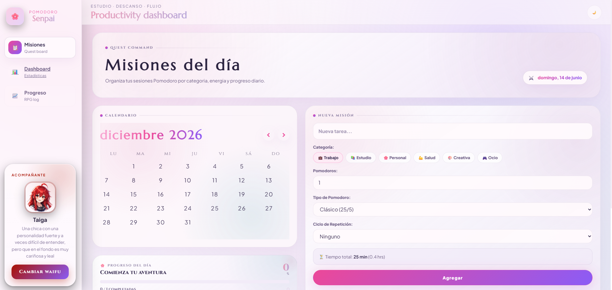
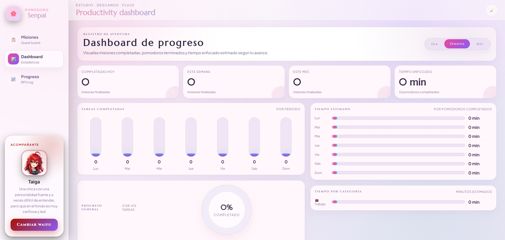
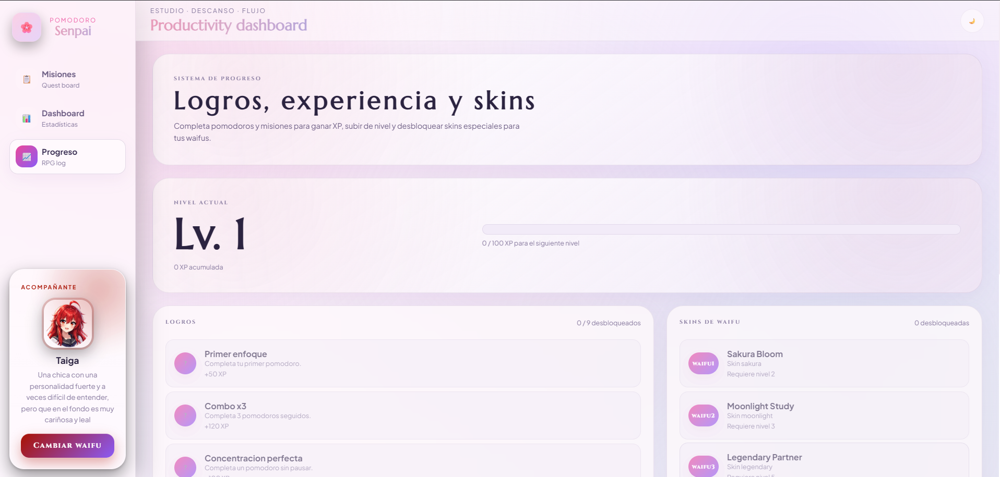
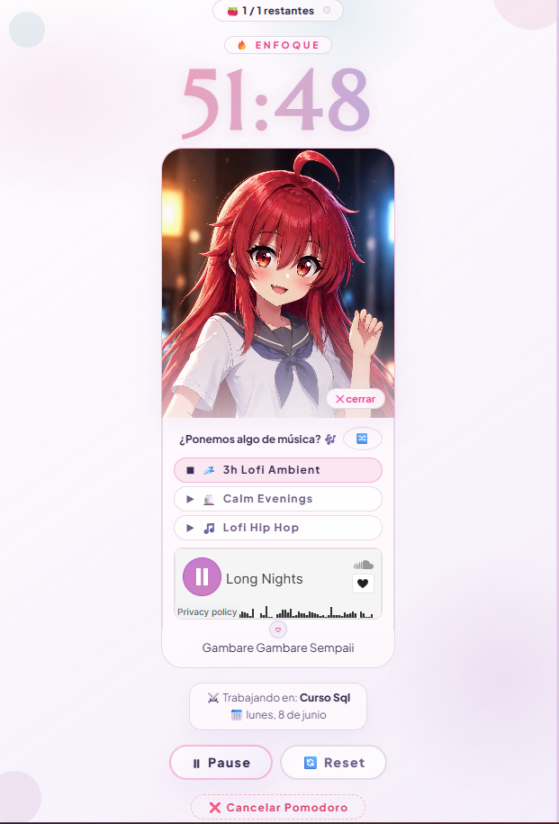

# ⚡ Anime RPG Pomodoro — *Senpai*

> A kawaii-flavored Pomodoro productivity app with an RPG leveling system and virtual waifu companion. Turn focus into a game.

[](https://react.dev)
[](https://www.typescriptlang.org)
[](https://vite.dev)
[](https://firebase.google.com)
[](https://reactrouter.com)
[](LICENSE)

---

## Table of Contents

- [Overview](#overview)
- [Features](#features)
- [Tech Stack](#tech-stack)
- [Architecture](#architecture)
- [Screenshots](#screenshots)
- [Getting Started](#getting-started)
- [Environment Variables](#environment-variables)
- [Scripts](#scripts)
- [Deployment](#deployment)
- [Design Decisions](#design-decisions)
- [Roadmap](#roadmap)
- [Contact](#contact)

---

## Overview

**Anime RPG Pomodoro** transforms the classic Pomodoro Technique into an immersive RPG experience. You manage tasks, run focused work sessions alongside a responsive anime waifu companion, earn XP, unlock achievements and skins, and track your productivity through a beautiful kawaii-themed dashboard.

Entirely client-side — no backend, no accounts, no data leaves your browser. Everything is persisted to `localStorage`.

[⬆ Back to top](#table-of-contents)

---

## Features

### 📋 Task Board
Create and manage tasks with categories (work, study, personal, health, creative, leisure), repetition rules (daily, weekdays, weekends), and custom Pomodoro modes. A calendar view powered by `react-day-picker` shows which days have tasks at a glance.

### ⏱️ Pomodoro Timer
Four timer presets:
| Mode | Focus | Break |
|------|-------|-------|
| Classic | 25 min | 5 min |
| 52/17 | 52 min | 17 min |
| 50/10 | 50 min | 10 min |
| Custom | User-defined | User-defined |

State machine transitions (`idle → running → paused → focus → break → finished → completed`), auto-cycling between focus and break sessions, pause tracking, and confetti celebration (`canvas-confetti`) on task completion.

### 👩‍🦰 Virtual Waifu Companion
Three unique companions, each with distinct personalities and visual styles:

| ID | Name | Personality | Accent Color |
|----|------|-------------|-------------|
| `waifu1` | Airi Mizuno | Supportive (shy → sweet) | `#A5D8FF` |
| `waifu2` | Anya | Cheerful (deredere) | `#ff69b4` |
| `waifu3` | Taiga | Tsundere (strong → loyal) | `#a91101` |

Each waifu responds to your Pomodoro state with mood-reactive expressions (happy, blush, sad, surprised, upset, focused, break, success), voice lines, and contextual dialog messages. Assets are auto-discovered using Vite's `import.meta.glob`.

### 🎮 RPG Progression System
- **XP & Levels** — Quadratic curve: `level = floor(sqrt(xp / 100)) + 1`
- **9 Achievements** — "First Focus", "Perfect Concentration", "Legendary Day", "Power Hour", and more (each grants XP)
- **3 Unlockable Skins** — Sakura Bloom (lvl 2), Moonlight Study (lvl 3), Legendary Partner (lvl 5)
- Unlocks are evaluated upon Pomodoro completion against session history and shown via alerts

### 📊 Analytics Dashboard
Pure CSS charts (no charting library) displaying:
- Summary cards (completed today / week / month, total focus time)
- Period selector (day / week / month)
- Completed tasks bar chart
- Time spent horizontal bars
- Task completion progress ring with top tasks
- Per-category breakdown

### 🎵 Background Music
12 curated lofi / jazzhop / ambient tracks served via SoundCloud embeds. Shuffle displays 3 random tracks at a time. Music panel toggles from the waifu assistant.

### 🌗 Dark Mode
System-preference-aware theme toggle persisted to `localStorage`. Full dark mode support across all components using CSS custom properties.

[⬆ Back to top](#table-of-contents)

---

## Tech Stack

### Core
| Technology | Purpose |
|---|---|
| [React 19](https://react.dev) | UI library |
| [TypeScript 5.9](https://www.typescriptlang.org) | Type safety |
| [Vite 8](https://vite.dev) | Build tool & dev server |
| [React Router 7](https://reactrouter.com) | Client-side routing |

### Dependencies
| Package | Purpose |
|---|---|
| [`react-day-picker`](https://daypicker.dev) + [`date-fns`](https://date-fns.org) | Calendar & date utilities |
| [`canvas-confetti`](https://github.com/catdad/canvas-confetti) | Celebration particle effects |
| [`sweetalert2`](https://sweetalert2.github.io) | Alert dialogs (duplicate task warnings) |

### Infrastructure
| Tool | Purpose |
|---|---|
| [Firebase Hosting](https://firebase.google.com) | Static site hosting with SPA rewrites |
| [ESLint](https://eslint.org) | Code linting |
| [pnpm](https://pnpm.io) | Package manager |

[⬆ Back to top](#table-of-contents)

---

## Architecture

### Provider Tree

The app uses **React Context** for state management with five nested providers:

```
BrowserRouter
 └── WaifuProvider          — Selected waifu & skin
      └── TasksProvider      — Task CRUD & persistence
           └── PomodoroSessionsProvider — Completed session logs
                └── ProgressionProvider  — XP, achievements, unlocks
                     └── PomodoroProvider — Active timer state
                          └── App
```

### Folder Structure

```
src/
├── app/                     # App shell, routing, global hooks
│   ├── App.tsx              # Route definitions & layout
│   ├── main.tsx             # Entry point, provider nesting
│   └── hooks/
│       └── useTheme.ts      # Dark mode with system preference
├── assets/
│   ├── captures/            # Screenshots for README
│   ├── music/               # SoundCloud track configuration
│   └── waifus/              # Waifu images & sounds (auto-discovered)
├── features/                # Feature-based modules
│   ├── tasks/               # Task board, calendar, CRUD
│   ├── pomodoro/            # Timer state machine & controller
│   ├── sessions/            # Session persistence layer
│   ├── progression/         # RPG levels, achievements, skins
│   ├── waifu/               # Companion avatar, mood, dialog, music
│   └── dashboard/           # Analytics & charts
├── shared/                  # Cross-cutting code
│   ├── components/          # GenericModal
│   ├── hooks/               # useSound (audio cache)
│   ├── layout/              # AppSidebar, AppTopbar
│   └── utils/               # Time formatting, alerts, date utils
├── index.css                # Global design system (design tokens)
└── vite-env.d.ts            # Vite type declarations
```

### Data Flow

- **All state** is managed via React Context + `useReducer` + custom hooks
- **Persistence** is handled by the `sessions` layer, reading/writing `localStorage` with versioned keys (`pomodoroSessions:v1`, `playerProgress:v1`)
- **Asset loading** uses Vite's `import.meta.glob` for zero-config discovery of waifu images, sounds, and skins
- **No backend** — every operation is local to the browser

[⬆ Back to top](#table-of-contents)

---

## Screenshots

### 🏠 Home — Task Board

The main task management screen with calendar, task creation form, and organized task list by category.



### 📊 Dashboard — Analytics

Visual breakdown of your productivity with day/week/month filtering, completion charts, and category analysis.



### 📈 Progress — RPG Progression

Track your XP, level up, unlock achievements, and see available waifu skins.



### ⏱️ Pomodoro — Focus Session

Active timer with waifu companion, mood-reactive avatar, dialog messages, background music controls, and progress indicators.



[⬆ Back to top](#table-of-contents)

---

## Getting Started

### Prerequisites

- [Node.js](https://nodejs.org) >= 18
- [pnpm](https://pnpm.io/installation) (recommended) or npm

### Installation

```bash
# Clone the repository
git clone https://github.com/your-username/anime-rpg-pomodoro.git
cd anime-rpg-pomodoro/frontend

# Install dependencies
pnpm install
```

### Development

```bash
pnpm dev
```

Opens at `http://localhost:5173` with Hot Module Replacement.

### Build for Production

```bash
pnpm build
```

Outputs optimized static files to the `dist/` directory.

### Preview Production Build

```bash
pnpm preview
```

[⬆ Back to top](#table-of-contents)

---

## Environment Variables

This project currently **does not require any environment variables**. All data is stored locally in the browser's `localStorage`. The `.env` and `.env.local` files are gitignored by default for future extensibility (e.g., adding a backend API key).

[⬆ Back to top](#table-of-contents)

---

## Scripts

| Command | Description |
|---|---|
| `pnpm dev` | Start Vite development server with HMR |
| `pnpm build` | Run TypeScript type check + Vite production build |
| `pnpm preview` | Preview the production build locally |
| `pnpm lint` | Run ESLint across the project |

[⬆ Back to top](#table-of-contents)

---

## Deployment

The app is deployed to **Firebase Hosting** under the project `pomodoro-sempaii`.

### Deploy manually

```bash
# Build the project
pnpm build

# Deploy to Firebase
firebase deploy --only hosting
```

The `firebase.json` configuration:
- Serves the `dist/` folder
- Rewrites **all routes** to `index.html` (SPA fallback)
- Ignores `firebase.json`, dotfiles, and `node_modules`

No CI/CD pipeline is currently configured — deployment is manual via the Firebase CLI.

[⬆ Back to top](#table-of-contents)

---

## Design Decisions

### Why no backend?
The app is intentionally 100% client-side. Task data, session history, and progression never leave the browser. This eliminates infrastructure costs, privacy concerns, and authentication complexity. localStorage with versioned keys provides sufficient persistence for a personal productivity tool.

### Why custom CSS instead of a framework?
Hand-crafted CSS with design tokens (`--color-primary`, `--spacing-md`, `--radius-lg`) gives full control over the kawaii aesthetic — pastel gradients, glassmorphism, heart animations. No framework would allow this level of visual personality without constant overrides.

### Why the waifu gamification layer?
The virtual companion serves as an emotional engagement mechanism. By reacting to the user's focus state (happy when starting, sad when canceling, surprised when time is low), the waifu transforms a solitary productivity tool into a shared experience. The RPG layer (XP, levels, achievements, unlockable skins) adds extrinsic motivation and a sense of long-term progression.

### Why 12 focused hooks for the Pomodoro controller?
The `usePomodoroController` orchestrator composes 12 single-responsibility hooks (timer, state machine, session tracking, cycling, auto-start, cancellation, display, messaging, sound effects, confetti, celebration) rather than one monolithic hook. This makes each concern independently testable and maintainable.

### Why SoundCloud for music instead of local files?
Embedding SoundCloud widgets via iframe avoids hosting audio files, reduces bundle size, and provides access to a wide variety of copyright-cleared lofi/jazzhop content. The shuffle picks 3 random tracks from a curated list of 12.

### Why dynamic asset loading with `import.meta.glob`?
Vite's glob import automatically discovers all waifu assets (images, sounds, configs) from the directory structure. Adding a new waifu requires only creating a folder with the correct file names — zero code changes to the asset loading logic.

[⬆ Back to top](#table-of-contents)

---

## Roadmap

Features inferred from the current codebase state and likely next steps:

- [x] Core Pomodoro timer with 4 modes
- [x] Task management with repetition
- [x] Waifu companion system (3 characters)
- [x] RPG level & achievement system
- [x] Analytics dashboard
- [x] Dark mode
- [ ] **Waifu skin image assets** — The skin unlock system is fully coded (Sakura Bloom, Moonlight Study, Legendary Partner) but no skin PNG files exist yet in `src/assets/waifus/*/skins/`
- [ ] **Backend sync** — Optional account-based sync to preserve progress across devices
- [ ] **More achievements** — Additional milestone achievements to extend the progression curve
- [ ] **Custom waifu dialog** — Expand the messaging system with more contextual phrases
- [ ] **CI/CD pipeline** — Automated deployment via GitHub Actions on push to main
- [ ] **PWA support** — Service worker for offline usage and installability
- [ ] **Sound effects polish** — Additional waifu voice lines

[⬆ Back to top](#table-of-contents)

---

## Contact

Developed as part of a personal portfolio project.

- **Portfolio:** [\[ Portfolio \]](https://acgdev.web.app/) 
- **GitHub:** [@al148506](https://github.com/al148506)
- **Email:** al148506@hotmail.com

---

<div align="center">
  <sub>Built with 💜 and lots of coffee — and waifu encouragement.</sub>
</div>

